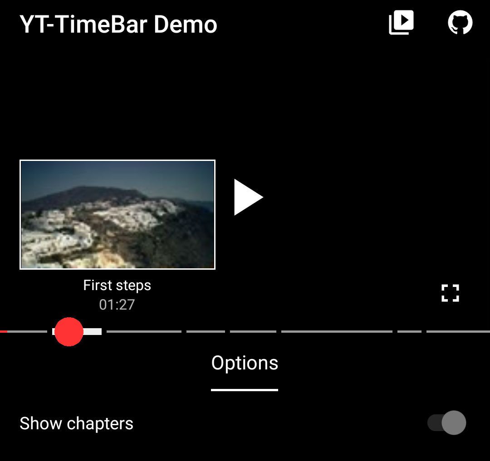
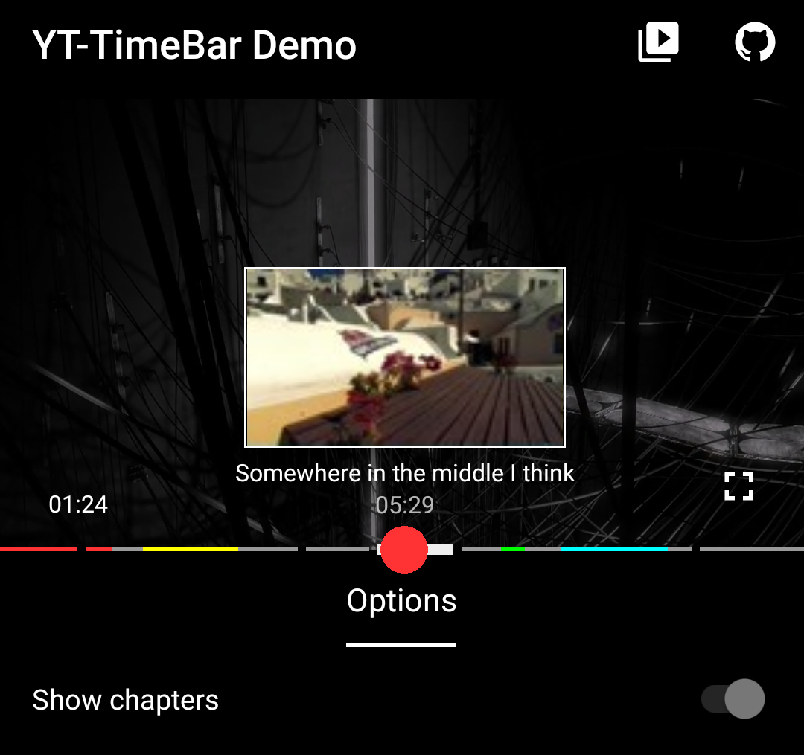
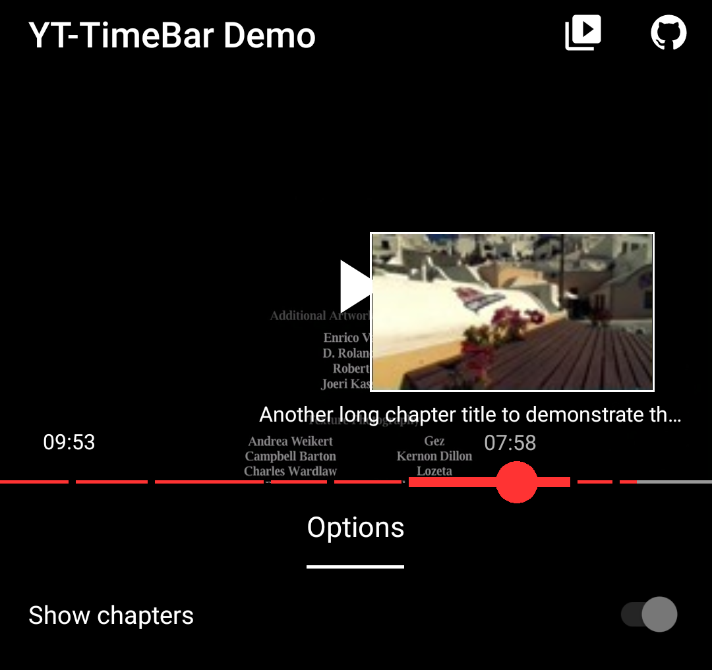

# YouTubeTimeBar
A TimeBar in YouTube-style providing Chapters, Image-Preview and Segments.

<p align="center">
  
  
  
</p>

## Features

- Chapters: Divide the TimeBar into pieces to highlight them during scrubbing
- Preview: Tweak the seek experience by showing image preview, timestamps and - if you're using chapters - an additional title
- Segments: Mark parts colorfully
- Extends from ExoPlayer's `TimeBar`, so you can use it the same way as `DefaultTimeBar`
- Notch-observable

# Sample app

The sample app lets you test the features by turning them on and off. You can find the latest APK under the Release section. Currently the app supports portrait mode only, an additional landscape toggle is added later.

# Download 

<a href="https://github.com/vkay94/YouTubeTimeBar/releases/tag/0.1.0" alt="GitHub release 0.1.0">

</a>
<a href="https://github.com/vkay94/YouTubeTimeBar/releases/tag/0.1.0-exoplayer-2.11.8" alt="GitHub release 0.1.0 legacy">

</a>

The Gradle dependency is available via [jitpack.io][jitpack]. There is also a version based on ExoPlayer version 2.11.8 in case your app doesn't use the latest version and its changes.
To be able to load this library, you have to add the repository to your project's gradle file:

```gradle
allprojects {
    repositories {
        ...
        maven { url 'https://jitpack.io' }
    }
}
```

Then, in your app's directory, you can include it the same way like other libraries. Make sure that you set the comnpatibilty version to 1.8 inside `compileOptions`: 

```gradle
android {
    ...
    compileOptions {
        sourceCompatibility JavaVersion.VERSION_1_8
        targetCompatibility JavaVersion.VERSION_1_8
    }
}

dependencies {
    implementation 'com.github.vkay94:YouTubeTimeBar:{latest_version}'
}
```

The minimum API level supported by this library is API 16.

# Getting started

The full feature consists of two Views, `YouTubeTimeBar` and `YouTubeTimeBarPreview`, but you can also use the TimeBar as standalone with chapter and segment support.

### YouTubeTimeBar

You can either put the View as a replacement of `DefaultTimeBar` - just make sure that ExoPlayer's id is matching (`@id/exo_progress`) - or use it as a progress bar outside of the controls and update the values manually (you can find an example implementation [here][exampleMainProgress]):

```xml
<FrameLayout
    android:layout_width="match_parent"
    android:layout_height="match_parent" >
    
    <com.github.vkay94.timebar.YouTubeTimeBar
        android:id="@+id/youtubeTimeBar"
        android:layout_width="match_parent"
        android:layout_height="wrap_content" />
        
</FrameLayout>
```

### YouTubeTimeBarPreview

This View can be placed whereever you like, just make sure, that you don't set horizontal margins. The best way is to set the `paddingLeft` and `paddingright` properties to add some space to the outer ViewGroup:

```xml
<com.github.vkay94.timebar.YouTubeTimeBar
    android:id="@+id/youtubePreview"
    android:layout_width="match_parent"
    android:layout_height="wrap_content"
    android:paddingLeft="16dp"
    android:paddingRight="16dp" />
```

### Code implementation

In the following you'll see the basic implementation in Kotlin by using the View Binding syntax. For a fully working example look for the [MainActivity][exampleMainProgress] of the example which updates the Views periodically with a Handler.

```kotlin
fun initViews() {
    // Add the listener to react on the events
    binding.youtubeTimeBar.addSegmentListener(object : LibTimeBar.SegmentListener 
        override fun onSegmentChanged(timeBar: LibTimeBar, newSegment: YouTubeSegment?) {
            if (newSegment is YTSegment) {
                Toast.makeText(this@MainActivity, "Hello new segment", Toast.LENGTH_SHORT).show()
            }
        }

        override fun onChapterChanged(timeBar: LibTimeBar, newChapter: YouTubeChapter, drag: Boolean) {
            if (newChapter is YTChapter) {
                // Do something, for example vibrate shortly
            }
        }
    }

    // Assigns the values 
    binding.youtubeTimeBar.timeBarPreview(binding.youtubeTimeBarPreview)
    binding.youtubeTimeBar.chapters = chaptersList
    binding.youtubeTimeBar.segments = segmentsList

    // Add thumbnail loading handling
    binding.youtubePreview.previewListener(object : YouTubeTimeBarPreview.Listener {
        override fun loadThumbnail(imageView: ImageView, position: Long) {
            // Load your image here into the ImageView, for example, by using Glide.
            // Please make sure, that you're performing expensive operations like cropping bitmaps on another 
            // background thread (for example by using RxJava) since this code block is called on the UI thread 
            // very often.
        }
    })

    // Set an interval to the frame loading. Whenever the scrubbed position is outside the interval 
    // (= previous loaded position) loadThumbnail is fired.
    binding.youtubePreview.durationPerFrame(20 * 1000)
}
```

# API documentation

The following sections provide detailed documentation for the components of the library. All public methods are described in the KDoc. You can also check the MainActivity of the example package [here][exampleMainProgress] for a sample implementation seen in the demo app.

## YouTubeTimeBar

### XML attributes

| Attribute name | Description | Type |
| ------------- | ------------| ------|
| `yt_played_color` | Color of the playback progress. Default: red | `color`
| `yt_unplayed_color` | Color of the unplayed part. Default: grey | `color`
| `yt_buffered_color` | Color of the buffered progress. Default: white | `color` 
| `yt_scrubber_color` | Color of the circle (normal and dragged). Default: red | `color` 
| `yt_scrubber_size_enabled` | Size of the scrubber on focus. Default: _12dp_ | `dimen`
| `yt_scrubber_size_dragged` | Size of the scrubber on drag. Default: _20dp_| `dimen`

### Methods

```kotlin
// Shows / hides the scrubber circle.
fun showScrubber() / hideScrubber()

// Sets the Preview-View to the TimeBar. If `null` is passed the Preview-View is removed from this TimeBar.
fun timeBarPreview(preview: YouTubeTimeBarPreview?)

// Returns the current playback position / total duration / buffered position in millisenconds.
fun getPosition() / fun getDuration() / fun getBufferedPosition()
```

### LibTimeBar.SegmentListener

This interface listens for chapter and segment changes. You can add it with `addSegmentListener(listener)`.

```kotlin
// Called when the current position has _entered_ the segment interval, either by progress update or releasing the drag on it.
fun onSegmentChanged(timeBar: LibTimeBar, newSegment: YouTubeSegment?)

// Called when the chapter changes during dragging.
fun onChapterChanged(timeBar: LibTimeBar, newChapter: YouTubeChapter, drag: Boolean)
```

### *YouTubeChapter* and *YouTubeSegment*

`YouTubeChapter` is an interface which requires a start time and a title. For example, let a data class implement it. `YouTubeSegment` requires a start and end time + some color to highlight the segment:

```kotlin
data class CustomChapter(val id: Int, override val startTimeMs: Long, override var title: String?)
```

Within the above listener you can then check via an instance check and execute code accordingly.

## `YouTubeTimeBarPreview`

### XML attributes

| Attribute name | Description | Type |
| ------------- | ------------| ------|
| `yt_preview_width` | Width of the preview ImageView. Default: _160dp_ | `dimen`
| `yt_preview_height` | Height of the preview ImageView. Default: _90dp_ | `color`
| `yt_chapter_title_max_width` | Max. width of the title TextView. Default: _200dp_ | `dimen` 

### Methods

```kotlin
// Makes the View Notch-observable. If set, the View _goes_ into the Notch-Area (Compat version).
fun adjustWithDisplayCutout(cutout: DisplayCutoutCompat?)

// Makes the View Notch-observable. If set, the View _goes_ into the Notch-Area (Android P+ version).
fun adjustWithDisplayCutout(cutout: DisplayCutout?)

// Sets the pixels manually (not recommended, but it's possible is required).
fun adjustWithDisplayCutout(leftPixels: Int, rightPixels: Int)

// Sets the interval between single frames (load calls during scrubbing) in milliseconds.
fun durationPerFrame(duration: Long)

// Whether to show the title of chapters.
fun useTitle(use: Boolean)

// Shows / hides the Preview-View with an alpha animation. The default duration is 300 milliseconds.
fun show(duration: Long) / fun hide(duration: Long)
```

### YouTubeTimeBarPreview.Listener

This interface lets you load the currect frame depending on the position to the ImageView. Optionally you can also listen for intersection (I recommend the [MainActivity implementation][exampleMainProgress] for a better understanding).

```kotlin
// Called during scrubbing and passes the current scrubbing position. The ImageView is the one within the frame.
fun loadThumbnail(imageView: ImageView, position: Long)

// Called when the bounds of the whole view are changed. Lets you react for intersections.
fun onPreviewPositionUpdate(viewRect: Rect)
```

*loadThumbnail*: Fired on drag whenever the seek position is outside of the interval defined by `YouTubeTimeBar.durationPerFrame(millis)`.

*onPreviewPositionUpdate*: Fired whenever the screen position or bounds of the View are changed. The passed Rect is the whole visible View.

# License

    Copyright 2021 Viktor Krez
    
    Licensed under the Apache License, Version 2.0 (the "License");
    you may not use this file except in compliance with the License.
    You may obtain a copy of the License at
    
        http://www.apache.org/licenses/LICENSE-2.0
    
    Unless required by applicable law or agreed to in writing, software
    distributed under the License is distributed on an "AS IS" BASIS,
    WITHOUT WARRANTIES OR CONDITIONS OF ANY KIND, either express or implied.
    See the License for the specific language governing permissions and
    limitations under the License.

[jitpack]: https://jitpack.io
[exampleMainProgress]: https://github.com/vkay94/YouTubeTimeBar/blob/main/example/src/main/java/com/github/vkay94/timebar/example/MainActivity.kt
